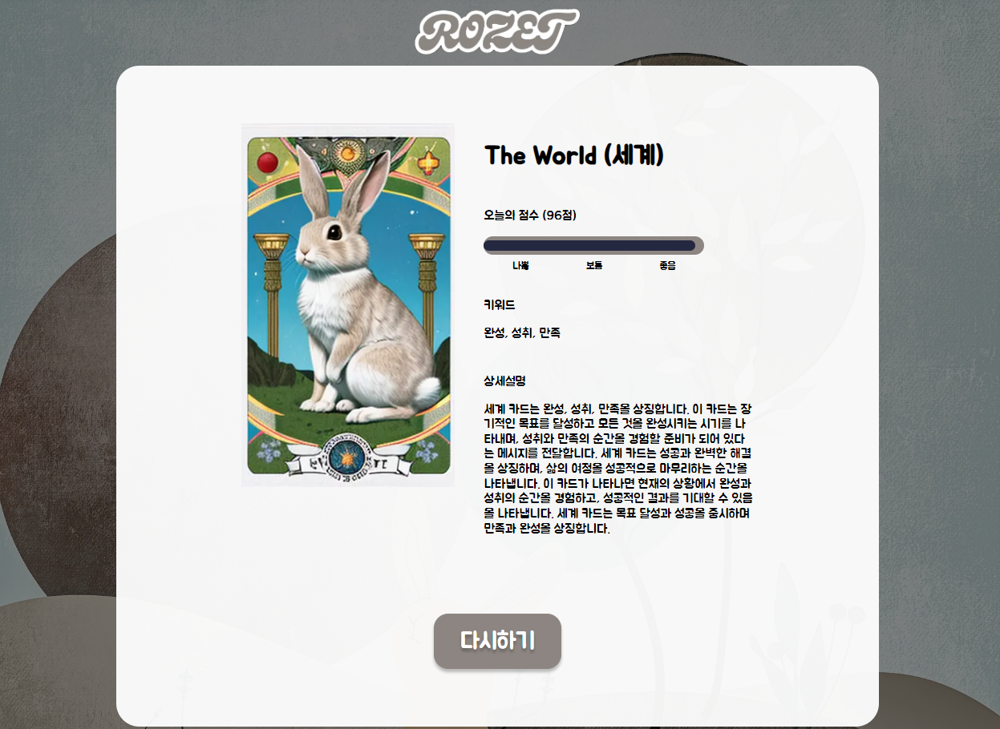

# Rozet

타로카드로 오늘의 운세를 확인할수 있습니다.



## Requirement

```
javascript, react, vite, prettier, Eslint, babel, core-js, recoil, framer-motion, commitlint, husky, lint-stage
```

## How to run?

```bash
npm install
npm run dev
```

## Project structure

```
$ tree
├─public
└─src
    ├─assets 미디어데이터
    ├─components 재사용 가능한 컴포넌트
    ├─constants 상수데이터
    ├─hooks 커스텀훅 액션함수
    ├─app.jsx 컴포넌트
    ├─main.jsx 실행지점
    └─utils 계산함수 유틸함수
```

## Commit rule

```
feat        새로운 기능을 제공합니다.
fix         버그 수정.
docs        문서만 변경됩니다.
style       코드 작동에 영향을 미치지 않는 스타일 변경(빈 공간, 코드 포멧팅, 누락된 세미콜론 등)
refactor    버그를 수정하거나 기능을 추가하지 않는 코드 변경입니다.
test        테스트 코드를 추가하거나 기존 테스트 코드를 수정합니다.
chore       빌드 프로세스 또는 보조 도구 및 라이브러리(예: 문서 생성)에 대한 변경 사항.
perf        성능을 향상시키는 코드 변경입니다.
ci          CI 구성 파일 및 스크립트의 변경 사항.
build       빌드 시스템 또는 외부 디펜던시에 영향을 미치는 변경 사항(예: gulp, broccli, npm).
temp        변경사항에 포함되지 않는 임시 커밋입니다.
```

이 프로젝트는 [notion](https://gaudy-baryonyx-7e4.notion.site/Rozet-f430db6ee9044cd7a6c094e11c7edffb?pvs=4)으로 관리했어요.

디자인은 간단하게 [figma](https://www.figma.com/file/lrJ23tmQquC2itAwnH0pqZ/ROZET?type=design&mode=design&t=oTHfc7sjFo4SyOL9-1) 로 제작했어요.
